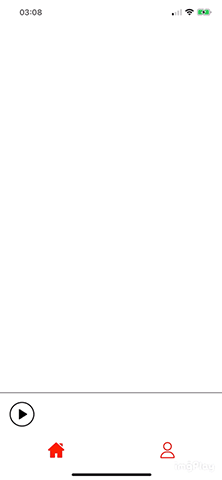

<h1 align="center">
    
React Native Radio Streaming

</h1>

<h1>
Features
</h1>

<h5>

- Background audio streaming of remote stream

- Control via sticky notification on android and media center on iOS

- Shoutcast/Icy meta data support

- Simple UI player component (if needed, an api to control the sound is available)

</h5>

<h1 align="center">
    
    
</h1>

<h1>
Instalation App
</h1>

<h4>
1- $ git clone https://github.com/Mik3Andrade/ReactNativeRadioStreaming.git
</h4>

<h4>
2- $ npm install
</h4>

<h2>Credits</h2>
<h4>
This project was made based on these repositories:
  
android: <a href="https://github.com/react-native-kit/react-native-track-player">react-native-kit/react-native-track-player</a>  
ios: <a href="https://github.com/tlenclos/react-native-audio-streaming">react-native-audio-streaming</a>

</h4>
